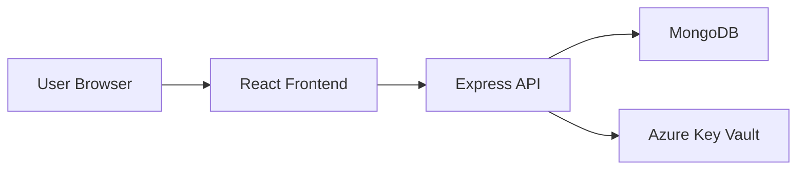
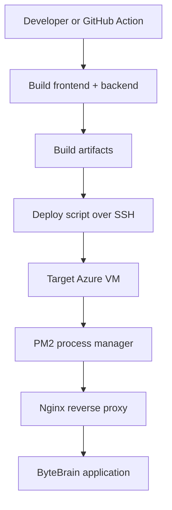
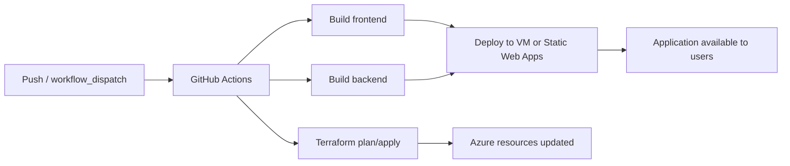

# ByteBrain

ByteBrain is a second brain application for managing and sharing content such as articles, images, and other knowledge items. The project combines a React frontend, an Express/TypeScript backend, MongoDB storage, and Docker-based deployment.

## Overview

ByteBrain allows users to:
- create an account and sign in securely
- create, view, update, and delete content entries
- browse content by type
- share content through a unique brain link
- access a dashboard for personal content management
- use a modern responsive UI with dark mode support

## Tech Stack

### Frontend
- React 19
- TypeScript
- Vite
- React Router
- React Query
- Tailwind CSS
- Axios
- Sonner for toast notifications

### Backend
- Node.js
- Express.js
- TypeScript
- MongoDB with Mongoose
- JWT-based authentication
- Zod for request validation
- CORS support

### DevOps / Deployment
- Docker and Docker Compose
- Nginx
- Terraform and Packer configuration under the infra and packer folders

## Repository Structure

```text
backend/         # Express API and TypeScript source
frontend/        # React/Vite client application
infra/           # Terraform infrastructure definitions
packer/          # Packer build scripts and deployment automation
scripts/         # Helper deployment scripts
nginx.conf       # Reverse proxy configuration for the app stack
docker-compose.yml  # Local container orchestration
```

## Prerequisites

Before running the project locally, make sure you have:
- Node.js 20+ and npm
- Docker and Docker Compose
- MongoDB (or use the Docker Compose MongoDB service)

## Quick Start with Docker Compose

The easiest way to run the full stack is with Docker Compose.

1. Clone the repository
2. Create a backend environment file:

```bash
mkdir -p backend
cat > backend/.env <<'EOF'
DATABASE_URL=mongodb://mongo:27017/bytebrain
JWT_SECRET=your-super-secret-jwt-key
EOF
```

3. Start the services:

```bash
docker compose up
```

4. Open the application:
- Frontend: http://localhost:5173
- Backend API: http://localhost:3000
- Health check: http://localhost:3000/api/v1/health

The MongoDB service is exposed on port 27017.

## Running Locally Without Docker

### Backend

```bash
cd backend
npm install
cp .env.example .env
npm run dev
```

Required backend environment variables:

```env
DATABASE_URL=mongodb://127.0.0.1:27017/bytebrain
JWT_SECRET=your-super-secret-jwt-key
```

The backend starts on port 3000 by default.

### Frontend

```bash
cd frontend
npm install
npm run dev
```

The frontend development server will run on port 5173 by default.

## Available Scripts

### Backend

```bash
cd backend
npm run build
npm run dev
npm run start
npm run start:pm2
npm run stop:pm2
```

### Frontend

```bash
cd frontend
npm run dev
npm run build
npm run lint
npm run preview
```

## API Overview

The backend serves API routes under the `/api/v1` prefix.

Common routes include:
- `GET /api/v1/health` – health check
- `POST /api/v1/signup` – create a new account
- `POST /api/v1/login` – authenticate a user
- `POST /api/v1/content` – create content
- `GET /api/v1/contents` – fetch all contents
- `PUT /api/v1/update-content` – update a content item
- `DELETE /api/v1/delete-content` – delete a content item
- `POST /api/v1/share` – share a brain or content item
- `GET /api/v1/me` – get the current authenticated user

## Frontend Routes

The app includes the following main pages:
- `/` – landing page
- `/signup` – registration page
- `/login` – sign-in page
- `/dashboard` – user dashboard
- `/brain/:hash` – shared brain page
- `*` – error page

## Infrastructure and Deployment

ByteBrain supports two deployment paths:

1. a local/containerized development path using Docker Compose
2. a cloud deployment path using Azure, Terraform, Packer, and GitHub Actions

### Current Terraform state

The Terraform configuration in [infra](infra) is centered around Azure infrastructure for ByteBrain. In the current repository state, it primarily provisions:

The main entry point is [infra/main.tf](infra/main.tf), while [infra/backend.tf](infra/backend.tf) configures the remote backend used by Terraform.

### Azure topology

The repository also contains a richer set of Azure modules under [infra/modules](infra/modules), and are referenced in [infra/main.tf](infra/main.tf) . These modules describe an earlier architecture that was provisioned and later destroyed, including:
- Azure Container Registry (ACR)
- Azure Front Door
- Virtual Network and subnets
- Azure Bastion
- NAT Gateway
- Load Balancer
- VM Scale Set
- App Service / Linux Web App

### Runtime architecture



### Deployment flow



### Deployment script behavior

The deployment script in [scripts/deploy.sh](scripts/deploy.sh) performs a versioned release rollout to the target VM:
- creates a timestamped release directory
- uploads the built frontend and backend assets
- writes a production environment file with the database and JWT settings
- switches the app to the new release using a symlink
- reloads the backend with PM2
- validates the deployment with the health endpoint
- rolls back automatically if the health check fails

This gives the project a simple release-management pattern similar to blue/green deployments, without requiring a full orchestrator.

### Packer image pipeline

The [packer](packer) folder contains assets for building a reusable VM image for the application environment. The main entry point is [packer/build.sh](packer/build.sh), which:
- initializes Packer
- validates the image template
- builds a VM image in Azure
- publishes a new image version for use by infrastructure components such as VMSS

### GitHub Actions pipelines

The repository includes the following workflows under [.github/workflows](.github/workflows):

- [deploy-bytebrain.yml](.github/workflows/deploy-bytebrain.yml)
  - manually triggered
  - builds the frontend and backend
  - deploys them to a VM using SSH and the deployment script

- [deploy-frontend.yml](.github/workflows/deploy-frontend.yml)
  - manually triggered
  - builds the React app and deploys it to Azure Static Web Apps

- [infra-create.yml](.github/workflows/infra-create.yml)
  - runs on push to the infra folder or manually
  - runs Terraform init, validate, plan, and apply

- [infra-destroy.yml](.github/workflows/infra-destroy.yml)
  - manually triggered
  - destroys the provisioned infrastructure after confirmation

- [infra-drift-check.yml](.github/workflows/infra-drift-check.yml)
  - runs on a schedule and manually
  - checks whether the live Azure environment has drifted from the Terraform state
  - opens a GitHub issue if drift is detected

### CI/CD pipeline overview



## Development Notes

- The frontend uses a proxy-style API setup and expects the backend to be reachable through the application runtime environment.
- Authentication tokens are stored in browser local storage for the current session.
- The backend establishes a MongoDB connection during startup and shuts down gracefully on termination signals.


## License

This project is currently licensed under the ISC license for the backend package definition.
